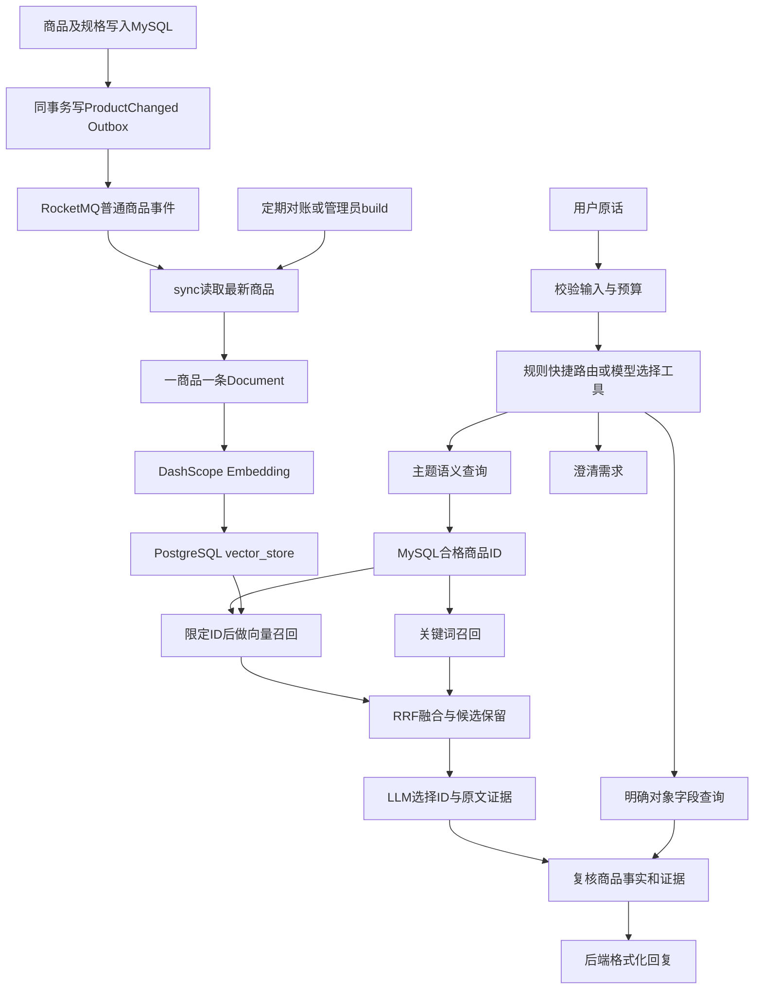

# 图书检索功能代码学习总结

> 核对日期：2026-09-17。本文按当前仓库实现讲解，覆盖导购入口、商品文档、Embedding、pgvector持久化、双路召回、RRF排序、选品、字段查询和失败处理。代码块为实际代码节选或等价展开，并补充学习注释；省略之处不代表可以将片段作为完整类直接运行。本次仅整理文档，没有重新进行模型评测。

## 阅读路线

第一次按 **1 → 2 → 3 → 4 → 7 → 8 → 9 → 10** 阅读，先理解在线查询；第二次读 **5 → 6 → 11**，理解数据如何生成、持久化和更新。最后用第12节的例子串联，用第14节的测试验证理解。

- [1. 系统全貌与概念](#1-系统全貌与概念)
- [2. 代码入口与调用关系](#2-代码入口与调用关系)
- [3. 自然语言如何变成查询](#3-自然语言如何变成查询)
- [4. Agent如何选择和执行工具](#4-agent如何选择和执行工具)
- [5. 商品文档、Chunk与Embedding](#5-商品文档chunk与embedding)
- [6. 向量如何持久化](#6-向量如何持久化)
- [7. 从商品条件到向量召回](#7-从商品条件到向量召回)
- [8. 关键词召回、融合与重排](#8-关键词召回融合与重排)
- [9. 候选如何变成推荐](#9-候选如何变成推荐)
- [10. 精确查询如何配合语义检索](#10-精确查询如何配合语义检索)
- [11. 商品更新与索引一致性](#11-商品更新与索引一致性)
- [12. 跟踪一次完整请求](#12-跟踪一次完整请求)
- [13. 兜底与能力边界](#13-兜底与能力边界)
- [14. 调试、测试与练习](#14-调试测试与练习)

## 1. 系统全貌与概念

### 1.1 三种问题，三种处理方式

| 问题 | 系统主要工作 | 是否需要向量 |
| --- | --- | --- |
| Java入门书，50块以下 | 理解主题，检索内容，过滤价格，选择推荐 | 通常需要 |
| 《Java 编程入门》多少钱、有货吗 | 定位商品，读取实时事实 | 不需要 |
| 50块以下有哪些书 | 按价格条件列商品 | 不需要 |

“语义相似”和“满足购买条件”解决不同的问题：内容再相关，也不能突破明确预算。作者、ISBN、书名等明确对象适合字段查询；主题、用途、风格适合语义检索。RAG是利用检索结果为模型提供证据的过程，并不要求所有查询都经过向量库。

### 1.2 两条链路



### 1.3 名词与当前实现对应

| 名词 | 含义 | 项目中的实现 |
| --- | --- | --- |
| Document | 可被检索的一份文本及其元数据 | 一条商品摘要 |
| Chunk | 长文本拆分后的检索单元 | 当前商品本身就是单元，没有固定字数切分器 |
| Embedding | 文本映射成数值向量 | DashScope text-embedding-v4，默认1024维 |
| 向量召回 | 找与查询向量接近的文档 | PgVectorStore余弦距离检索 |
| 关键词召回 | 按文本词项寻找候选 | 英文词、中文二元片段匹配 |
| 排序融合 | 将多路候选合为一张榜 | RRF，常数60 |
| 候选筛选/语义重排 | 根据完整需求再次选择候选 | LLM最多选5本；没有独立Cross-Encoder模型 |
| Grounding | 用真实资料约束回答 | 候选ID、原文引用、实时商品事实检查 |
| Agent工具调用 | 模型选择工具和参数，程序执行 | 单次原生tool_calls + Java白名单分发 |

## 2. 代码入口与调用关系

### 2.1 建议打开的文件

后端源码的共同根目录是 `tomatoMall-backend/src/main/java/com/example/tomatomall/`。

| 文件 | 阅读重点 |
| --- | --- |
| [ChatController](../../tomatoMall-backend/src/main/java/com/example/tomatomall/controller/ChatController.java) | `/api/chat/recommend`、`/api/chat/simple` |
| [ChatServiceImpl](../../tomatoMall-backend/src/main/java/com/example/tomatomall/service/serviceImpl/ChatServiceImpl.java) | 将两个入口委托给Agent |
| [BookShoppingAgent](../../tomatoMall-backend/src/main/java/com/example/tomatomall/shopping/BookShoppingAgent.java) | 路由、字段校验、精确查询 |
| [BookPurchaseFilter](../../tomatoMall-backend/src/main/java/com/example/tomatomall/shopping/BookPurchaseFilter.java) | 从原话提取可靠预算边界 |
| [BookToolPlanner](../../tomatoMall-backend/src/main/java/com/example/tomatomall/shopping/BookToolPlanner.java) | 调用模型选择工具 |
| [GroundedBookRecommendation](../../tomatoMall-backend/src/main/java/com/example/tomatomall/shopping/GroundedBookRecommendation.java) | 候选选品、证据检查、最终回复 |
| [ProductRetrievalService](../../tomatoMall-backend/src/main/java/com/example/tomatomall/retrieval/ProductRetrievalService.java) | 向量/关键词召回、RRF、候选池 |
| [ProductSearchQuery](../../tomatoMall-backend/src/main/java/com/example/tomatomall/retrieval/ProductSearchQuery.java) | 检索参数和商品准入条件 |
| [ProductCatalog](../../tomatoMall-backend/src/main/java/com/example/tomatomall/retrieval/ProductCatalog.java) | MySQL商品快照 |
| [ProductDocuments](../../tomatoMall-backend/src/main/java/com/example/tomatomall/retrieval/ProductDocuments.java) | 文本构造、稳定ID、内容哈希 |
| [DashScopeEmbeddingModelConfig](../../tomatoMall-backend/src/main/java/com/example/tomatomall/config/DashScopeEmbeddingModelConfig.java) | Spring AI与DashScope SDK适配 |
| [PgProductVectorIndex](../../tomatoMall-backend/src/main/java/com/example/tomatomall/retrieval/PgProductVectorIndex.java) | 向量检索、持久化、同步保护 |

### 2.2 前端只发送用户原话

[aiService.ts](../../tomatoMall-frontend/src/api/aiService.ts) 的核心代码：

```typescript
export const recommendBooks = (query: string) => {
  // 这里没有预先传作者、预算、目标商品等“答案”。
  // 智能导购入口接收原话，而不是手工构造的检索条件。
  return axios.post("http://localhost:8080/api/chat/recommend", { query: query })
}
```

[ChatServiceImpl](../../tomatoMall-backend/src/main/java/com/example/tomatomall/service/serviceImpl/ChatServiceImpl.java) 的委托：

```java
private final BookShoppingAgent agent;

@Override
public String chat(String message) {
    return agent.chat(message);
}

@Override
public String recommendBooks(String query) {
    return agent.chat(query);
}
```

注意：“普通聊天”和“推荐”目前都进入这个受限购书助手，不是两个不同的RAG实现。前端消息列表也不等于后端已有会话记忆；请求未携带多轮历史。

## 3. 自然语言如何变成查询

### 3.1 保留两份文本，各有用途

假设用户说：

> 最近工作很忙，晚上想从变量和循环开始学习，推荐Java入门书，50块以下，不想一开始就研究源码。

当前链路保留：

- **original**：原问题，预算解析和最终选品都使用它，避免语义提炼丢失偏好后无法核对。
- **semanticQuery**：模型提炼的语义需求，例如“Java入门，变量与循环，不从源码开始”；用于Embedding和关键词检索。具体提炼结果取决于模型，不是固定模板。
- **BookPurchaseFilter**：后端解析得到的明确上下限与库存策略，例如`maxPrice=50`。

用户问题不会先按固定字数切成chunk。“去掉闲话、保留需求”属于查询理解/改写；商品文档切块是另一件事。

### 3.2 先做低成本输入检查

`BookShoppingAgent.chat` 节选：

```java
// 防止空问题或无界输入；这里使用Java字符串长度。
if (original == null || original.isBlank() || original.length() > 1000) {
    return "问题长度应为1到1000字符。";
}

String text = original.trim();

// 固定短问候直接回应，不调用Embedding或LLM。
// 完整白名单还包含您好、在吗、hello、hi、谢谢、谢谢你。
if (Set.of("你好", "您好", "在吗", "hello", "hi", "谢谢", "谢谢你")
        .contains(text.toLowerCase(Locale.ROOT))) {
    return "你好！可以告诉我想看的主题、具体书名和每本预算。";
}

// true代表推荐默认仅考虑在售且有库存的商品。
// 解析不清时会抛IllegalArgumentException，上层将说明返回给用户。
BookPurchaseFilter filter = BookPurchaseFilter.fromText(text, true);
```

### 3.3 价格由规则确定，不让模型覆盖

`BookPurchaseFilter.fromText` 的初始化节选：

```java
// 《50元左右》可能是书名，不能把书名里的数字当预算。
String text = BOOK_TITLE.matcher(original == null ? "" : original)
        .replaceAll(" ");

// “预算￥50”归一化为“预算50”。
text = text.replaceAll("预算\\s*[￥¥]\\s*(?=[-+]?\\d)", "预算");

// 只对满足边界规则的无单位比较补上“元”。
// “不超过50页”不应因此变成价格条件。
text = BUDGET_WITHOUT_UNIT.matcher(text).replaceAll("$1$2元");
```

匹配条件后的比较逻辑节选：

```java
switch (comparison) {
    case "不低于", "至少", "以上" ->
        // 多个下限取最大值：至少30且至少40 => 至少40。
        minimum = minimum == null ? amount : minimum.max(amount);
    case "高于" -> {
        BigDecimal lower = amount.add(CENT); // 高于50 => 最低50.01。
        minimum = minimum == null ? lower : minimum.max(lower);
    }
    default -> {
        BigDecimal upper = comparison.equals("低于") || comparison.equals("不到")
                ? amount.subtract(CENT)     // 低于50 => 最高49.99。
                : amount;                   // 以下/以内/不超过50 => 最高50。
        maximum = maximum == null ? upper : maximum.min(upper);
    }
}
```

使用`BigDecimal`和0.01元边界，是因为商品价格按两位小数处理；不是把金额转成浮点数再依赖近似比较。

| 表述 | 当前处理 |
| --- | --- |
| 50块以下、不超过50元 | 上限50，包含50 |
| 低于50元、不到50元 | 上限49.99 |
| 预算50、预算￥50 | 明确上限50 |
| 至少30元且50元以下 | 30≤价格≤50 |
| 50元左右、再便宜一点 | 请求明确预算边界 |
| 两本总共50元 | 请求单本预算；尚不支持组合购书 |
| 预算五十 | 请求阿拉伯数字，当前没有中文金额转换器 |
| 预算管理入门书 | “预算”是主题，不能当金额错误 |

规则是有限语法，不能说“任意中文价格表达都支持”。能识别但无法确认的条件采取澄清；未覆盖表达仍需要扩充测试。

### 3.4 构造服务端查询参数

`BookShoppingAgent.search` 核心代码：

```java
// 模型只允许给语义文本，不能额外塞maxPrice、vectorWeight等字段。
fields(args, Set.of("semanticQuery"));
String semantic = string(args, "semanticQuery", false);

var query = new ProductSearchQuery(
    semantic,             // 模型提炼的语义文本
    null,                 // 不擅自推断分类标签
    filter.minPrice(),    // 从原话得到的确定下限
    filter.maxPrice(),    // 从原话得到的确定上限
    true,                 // 推荐必须有货且在售
    10,                   // 后端固定候选池规模
    "hybrid"              // 后端固定混合检索策略
);

// ProductSearchQuery保留旧金额识别逻辑。
// 若改写后的文本又产生不同金额，这里拒绝继续执行。
if (!Objects.equals(query.minPrice(), filter.minPrice())
        || !Objects.equals(query.maxPrice(), filter.maxPrice())) {
    throw new IllegalArgumentException("Rewritten query changed budget");
}

return recommendations.recommend(original, query);
```

本例没有自动生成`level=入门`、`excludedTopics=[源码]`。它们仍存在于旧检索调试接口，但当前导购把难度和排除偏好保留在语义需求和原问题中，由内容证据辅助判断。

## 4. Agent如何选择和执行工具

### 4.1 能直接判断的请求先走规则

`BookShoppingAgent.directLookup` 顺序：

1. 出现“类似、风格、不要、除了、读过”等表达，跳过直接定位，避免把参考书/排除书当成目标书。
2. 明确`ISBN ...`，构造`lookup_books`参数。
3. 单个`《书名》`，构造`lookup_books`参数。
4. 多个书名先澄清；其他输入调用模型选择工具。

这是一组快捷规则，不是完整的中文语法分析。例如某些复杂书名包含相同词汇时仍可能绕过快捷路径，随后依赖模型判断。

### 4.2 向模型提供工具说明

`BookToolPlanner.tools()`中的语义工具定义节选：

```java
tool(
    "search_books",
    "按主题、用途、阅读体验推荐；类似某作者风格或某书的需求也用此工具。",
    Map.of("semanticQuery", string(
        "保留主题、入门程度、用途及排除偏好，移除闲话和明确价格金额；只有价格条件时为空字符串。"
    )),
    List.of("semanticQuery")
);
```

`tool(...)`会包装成JSON Schema，包含`type=object`、`properties`、`required`及`additionalProperties=false`。另外两个工具是：

| 工具名 | 允许字段 | 作用 |
| --- | --- | --- |
| search_books | semanticQuery | 查主题/需求，或在空语义且有预算时列商品 |
| lookup_books | title、author、isbn | 查明确对象，字段之间取交集 |
| clarify | question | 提出澄清，不访问商品检索 |

**这里的工具不是模型能够直接执行的Java函数。** 工具Schema描述可用能力，模型只返回名称和参数，由Java代码执行。

### 4.3 原生tool_calls请求与响应

实际请求字段节选：

```java
"tools", tools(),
"tool_choice", "required",             // 要求选工具
"thinking", Map.of("type", "disabled"), // 路由使用非思考模式
"temperature", 0,
"max_tokens", 700
```

同一次请求携带系统约束和用户原话。使用的是现有DeepSeek HTTP接口；项目没有为了路由升级Spring AI M4，也没有使用其新版工具注解。

下面是**协议示意**，不是一次线上响应的逐字复制：

```json
{
  "tool_calls": [{
    "type": "function",
    "function": {
      "name": "search_books",
      "arguments": "{\"semanticQuery\":\"Java入门书\"}"
    }
  }]
}
```

注意`arguments`在协议里是JSON字符串，需要再次解析。`BookToolPlanner.choose`验证响应完成原因、恰好一个tool call、function类型、工具白名单和参数对象。

### 4.4 执行工具与控制边界

`BookShoppingAgent.chat`节选：

```java
BookToolPlanner.Call call = directLookup(text);
if (call == null) call = planner.choose(text);
var args = call.arguments();

String answer = switch (call.name()) {
    case "search_books" -> search(text, args, filter);
    case "lookup_books" -> lookup(text, args, filter);
    case "clarify" -> {
        fields(args, Set.of("question"));
        String question = string(args, "question", true);
        yield "需要确认你的购书需求：" + question;
    }
    default -> throw new IllegalArgumentException("Unsupported tool");
};
```

当前最多选择并执行一个查询工具。语义检索后另一次LLM调用负责选品；没有把tool结果回填后无限继续调用的循环。没有多轮记忆、自动加购、SQL生成或模型自定权重。

## 5. 商品文档、Chunk与Embedding

### 5.1 先把关系数据整理成商品快照

`ProductCatalog.snapshot`包含如下计算：

```java
// 可售库存 = 总库存 - 已冻结库存；缺失库存记录按0处理。
s == null ? 0 : s.getAmount() - s.getFrozen()
```

并将规格整理成`作者：余华`、`主题：Java`等字符串。`ProductSnapshot`是脱离JPA实体的事实快照，避免模型调用期间依赖懒加载对象。

`ProductCatalog.all/find`使用新的短只读MySQL事务。远程Embedding/LLM调用不占用这个MySQL事务；这不代表PG同步事务里也没有远程请求，见第11节。

### 5.2 Chunk：当前为什么一商品一条？

`ProductDocuments.text`实际文本模板：

```java
public static String text(ProductSnapshot p) {
    return "书名：" + p.title()
        + "\n分类：" + p.tag()
        + "\n简介：" + Objects.toString(p.description(), "")
        + "\n详情：" + Objects.toString(p.detail(), "")
        + "\n规格：" + String.join("；",
            p.specifications().stream().sorted().toList());
}
```

商品简介和详情较短，整个商品作为检索单元，能同时保留书名、主题、用途等信息。例如：

```text
书名：Java第一步（合成测试）
分类：science
简介：合成测试图书，主题：Java；难度：入门。内容：变量、循环与面向对象基础。
详情：……
规格：主题：Java；前置知识：无；学习目标：变量、循环与面向对象基础；适用难度：入门
```

**当前没有TokenTextSplitter、固定500字切分、滑动窗口或重叠chunk。** 也没有索引图书全文。框架对多个Document分批处理不等于把一本书拆成多个chunk。

未来若接入长目录/试读章节，可以按章节切分，并增加productId、chunkId、章节和文本版本；检索后按商品聚合去重。这是演进建议，尚未实现。

### 5.3 为什么文档不包含价格和库存？

价格和库存变化频繁，如果写入语义文本，每次变动都可能需要重新付费Embedding，还会让模型读到过期事实。

当前稳定文本用于“这是什么书、讲什么”；价格和库存从MySQL读取，检索过滤和回答时再加入。价格变更不改变`ProductDocuments.hash`，因此同步时通常跳过Embedding。

### 5.4 Document的ID和metadata

```java
public static String id(int productId) {
    // 同一个商品每次得到同一个UUID；不是每次随机新建一条。
    return UUID.nameUUIDFromBytes(
        ("product:" + productId).getBytes(StandardCharsets.UTF_8)
    ).toString();
}

public static Document document(ProductSnapshot p) {
    return new Document(
        id(p.id()),
        text(p),
        Map.of(
            "productId", p.id(),     // 检索后关联回MySQL商品
            "contentHash", hash(p),  // 判断稳定文本是否真的变化
            "textVersion", TEXT_VERSION
        )
    );
}
```

`hash(p)`对规范化文本算SHA-256；规格排序使仅顺序变化不触发无意义的重算。metadata当前没有价格、作者等独立过滤字段；作者可能出现在文本规格里，不能因此声称PG已经建立作者元数据过滤。

### 5.5 Embedding调用在哪里发生？

两种调用都由Spring AI的PgVectorStore触发：

```text
写入：store.add(Document) → EmbeddingModel → DashScope → 商品向量 → PG
查询：store.similaritySearch(SearchRequest) → EmbeddingModel → DashScope → 查询向量 → PG检索
```

本次核对了项目实际M4依赖的`doAdd`和`getQueryEmbedding`调用，避免把新版本框架API当成项目代码。

适配器中的实际请求节选：

```java
@Override
public float[] embed(String text) {
    validateCredentials(); // 缺少密钥直接失败，交上层决定如何降级。
    if (text == null || text.isBlank()) {
        throw new IllegalArgumentException("Embedding text must not be blank");
    }

    TextEmbeddingParam param = TextEmbeddingParam.builder()
        .model(model)                       // 默认text-embedding-v4
        .text(text)
        .apiKey(apiKey)
        .parameter("dimension", dimensions) // 默认1024
        .build();

    TextEmbeddingResult result;
    try {
        result = new TextEmbedding().call(param);
    } catch (Exception failure) {
        // 不把SDK可能包含输入/密钥的原始异常传播出去。
        throw new IllegalStateException("DashScope embedding request failed");
    }
    return extractEmbedding(result);
}
```

`extractEmbedding`进一步检查：恰好一条向量、维度符合配置、每个值有限且可转float、不能全为0。文档与问题使用同一模型及维度，才能在同一空间比较。

`embed(List<String>)`当前逐条调用`embed(text)`；不要误认为已实现供应商批量API或并行Embedding。连接、读取、响应超时默认分别为5/20/30秒，通过DashScope SDK的进程级连接设置配置。

## 6. 向量如何持久化

### 6.1 保存在哪里？

[infra/rag/init.sql](../../infra/rag/init.sql)中的表结构：

```sql
CREATE EXTENSION IF NOT EXISTS vector;

CREATE TABLE IF NOT EXISTS vector_store (
    id uuid PRIMARY KEY,             -- 稳定的商品文档UUID
    content text NOT NULL,           -- 原始商品摘要，检索证据可回溯
    metadata jsonb NOT NULL,         -- productId/contentHash/textVersion
    embedding vector(1024) NOT NULL  -- 固定维度的数值向量
);

CREATE TABLE IF NOT EXISTS rag_index_config (
    id integer PRIMARY KEY CHECK(id=1),
    fingerprint text NOT NULL        -- 当前向量库的配置指纹
);
```

数据库中的数据不依赖Java进程存活。后端重启后连回相同PG库，就能读取已有向量；不必先恢复一个内存HashMap。数据库本身的数据目录或Docker卷仍需保留，删除数据库当然会丢数据。

这里“向量索引持久化”主要指**可检索的文档/向量数据持久保存**。当前没有启用HNSW或IVFFlat近似最近邻索引；UUID主键索引也不是向量加速索引。

### 6.2 MySQL与PG分别连接

`PgProductVectorIndex`自己创建Hikari连接池、`JdbcTemplate`和PG事务管理器，不替换Spring Data JPA使用的MySQL数据源。关键配置：

```java
fingerprint = namespace + "|" + modelName + "|" + dimensions
        + "|" + ProductDocuments.TEXT_VERSION;

store = new PgVectorStore(
    jdbc, model, dimensions,
    PgVectorStore.PgDistanceType.COSINE_DISTANCE,
    false, PgVectorStore.PgIndexType.NONE, false
);
```

构造签名属于项目M4版本；只需把这里记为“使用余弦距离、当前不建近似向量索引、表结构由SQL预置”，不要直接搬到其他版本。

### 6.3 配置指纹防止混用向量

```java
private void compatible() {
    String actual = jdbc.queryForObject(
        "SELECT fingerprint FROM rag_index_config WHERE id=1", String.class);
    if (!fingerprint.equals(actual)) {
        throw new IllegalStateException(
            "Index model/dimension/namespace mismatch; use a new index database");
    }
}
```

namespace区分来源商品库；模型、维度、文本版本也参与指纹。首次写入会绑定空库，并核对实际`vector(N)`维度；已有未绑定向量时拒绝自动认领。

即使两个模型都输出1024维，也不能混在一个空间直接比较。更换模型或文档版本需要按项目约定建立新索引库。namespace在这里是**整个库的绑定检查**，不是已支持同表多租户隔离。

### 6.4 稳定ID和内容哈希各解决什么？

- 稳定ID：重复同步同一商品写回同一文档，PgVectorStore按ID插入/更新，避免重复记录。
- 内容哈希：文本没变时不调用`store.add`，省去重复Embedding。
- 配置指纹：防止把不同模型、数据源或文本版本的向量混用。

这三个机制目的不同，不能用“有UUID所以不会过期”来解释索引一致性。

## 7. 从商品条件到向量召回

### 7.1 先确定合格商品，避免被不合格商品挤掉

`ProductRetrievalService.search`节选：

```java
// 注意：当前catalog.all()读MySQL快照，在Java中执行条件过滤。
// 并非已经实现复杂SQL条件下推或分页商品索引。
var products = catalog.all().stream().filter(q::accepts).toList();
Set<Integer> eligibleIds = new HashSet<>();
products.forEach(p -> eligibleIds.add(p.id()));

if (!q.mode().equals("keyword") && !eligibleIds.isEmpty()) {
    try {
        for (var match : vectors.search(q.query(), 200, eligibleIds)) {
            // 省略：检查相似度为有限值且范围合理。
            similarities.merge(match.productId(),
                Math.max(-1, Math.min(1, match.similarity())), Math::max);
        }
    } catch (RuntimeException e) {
        similarities.clear();
        degraded = true;
        strategy = "keyword"; // 同一组购买条件下做关键词降级。
    }
}
```

`q.accepts(p)`检查在售、库存、价格、分类，以及旧接口可选的level/excludedTopics。当前Agent构造的q不包含后两者。

为什么不先取全库前200再过滤？假设前205本相似书都超过预算，预算内的一本排第206，那么后过滤永远看不到它。当前先限制ID，再做topK，已用真实PG反例测试验证。

### 7.2 将ID约束传入PgVectorStore

```java
@Override
public List<Match> search(String query, int limit, Set<Integer> eligibleIds) {
    // 没有合格商品时，不产生无意义的模型调用。
    if (eligibleIds.isEmpty()) return List.of();

    var filter = new Filter.Expression(
        Filter.ExpressionType.IN,
        new Filter.Key("productId"),
        new Filter.Value(eligibleIds.stream().sorted().toList())
    );

    return search(SearchRequest.query(query)
        .withTopK(limit)                 // 当前服务传200
        .withSimilarityThreshold(0.3)   // 底层宽召回门槛
        .withFilterExpression(filter)); // metadata.productId限制
}
```

重要区别：**预算在MySQL快照上判断，再转换成合格ID限制；不是把“50元”交给向量模型去理解价格。** 模型也没有生成SQL。

下面仅为帮助理解的等价SQL示意，非项目手写执行的原句：

```sql
SELECT id, content, metadata,
       1 - (embedding <=> :query_vector) AS similarity
FROM vector_store
WHERE (metadata->>'productId')::integer = ANY(:eligible_ids)
  AND (embedding <=> :query_vector) <= :max_cosine_distance
ORDER BY embedding <=> :query_vector
LIMIT :candidate_limit;
```

实际SQL由Spring AI M4的过滤转换与PgVectorStore生成。`:...`是示意占位符，不能把这段直接当成可执行脚本。

### 7.3 查询文本如何匹配商品文本？

Embedding模型分别生成商品向量`d`和查询向量`q`。余弦相似度可理解为：

```text
cosine_similarity(q,d) = dot(q,d) / (norm(q) × norm(d))
cosine_distance       = 1 - cosine_similarity
```

它比较的是模型学习到的语义表示，而不是逐字匹配。所以“从变量循环开始学习编程”有机会找到介绍“Java基础”的书；也可能误召回主题邻近的书，因此仍需要关键词、事实过滤和后续选品。

M4返回结果里使用`metadata.distance`，适配器将其转回相似度：

```java
return store.similaritySearch(request).stream()
    .map(d -> new Match(
        Integer.parseInt(d.getMetadata().get("productId").toString()),
        1.0 - ((Number)d.getMetadata().get("distance")).doubleValue()
    ))
    .distinct().toList();
```

`0.8`不是“80%一定适合”。相似度取决于模型、文本构造和数据分布，门槛必须通过评测确定。

### 7.4 0.30和0.54为什么同时存在？

| 层次 | 当前值/行为 | 目的 |
| --- | --- | --- |
| PG基础召回 | similarity≥0.30，最多200条 | 留出较宽候选 |
| 普通search的向量路 | 再要求默认≥0.54，可配置 | 减少低相关检索结果 |
| 聊天candidates的向量路 | 使用≥0.30 | 避免过早丢失有用候选，后续交LLM判断 |

关键词命中的书不必达到向量门槛。普通混合结果中的`vectorSimilarity`低于0.54，可能因为它通过关键词路入选；这不是服务端绕过预算。

## 8. 关键词召回、融合与重排

### 8.1 当前关键词算法比较简单

`keywordScore`主要步骤：小写转换 → 去掉部分常见提问词 → 提取英文词或中文连续片段 → 中文切二元片段 → 计分。

```java
var matcher = Pattern.compile("[a-z][a-z0-9+#.-]*|[\\p{IsHan}]+")
        .matcher(cleaned);

while (matcher.find()) {
    String word = matcher.group();
    if (word.charAt(0) < 128) {
        tokens.add(word); // Java、Redis等作为词项。
    } else {
        for (int i = 0; i < word.length() - 1; i++) {
            tokens.add(word.substring(i, i + 2)); // “入门教程”=>入门、门教、教程。
        }
    }
}

int score = 0;
for (String token : tokens) {
    if (ProductText.contains(text, token)) {
        score += ProductText.contains(title, token) ? 3 : 1;
    }
}
```

这里不是BM25，没有IDF、专业中文分词器或全文搜索引擎。去词规则也可能误删有意义词，二元片段可能产生噪声；这是现有质量限制。

`ProductText.contains`对英文词加边界：

```java
Pattern.compile("(?<![a-z0-9_])" + Pattern.quote(term) + "(?![a-z0-9_])")
       .matcher(text).find();
```

因此关键词`Java`不因为是`JavaScript`的前缀而命中。该规则仅保护词项匹配，不能保证向量模型永远不会认为JavaScript与Java相关。

### 8.2 RRF融合的是名次，不是原始分数

两路原始分数不同：关键词是命中计分，向量是余弦相似度。当前用名次统一融合：

```java
private static void fuse(Map<Integer,Double> scores, List<Integer> ids) {
    int rank = 0;
    for (int id : new LinkedHashSet<>(ids)) {
        // 一路里出现一次，按名次加分；两路都出现则累加。
        scores.merge(id, 1.0 / (60 + (++rank)), Double::sum);
    }
}
```

计算示例，数字仅用于解释算法：

| 商品 | 向量名次 | 关键词名次 | RRF |
| --- | ---: | ---: | ---: |
| A | 1 | 2 | 1/61+1/62≈0.03252 |
| B | 2 | 无 | 1/62≈0.01613 |
| C | 无 | 1 | 1/61≈0.01639 |

融合顺序是A、C、B。这里两路贡献形式相同，常数60由后端代码控制，没有Agent提供的70%/30%权重。

结果里的`score`是RRF分数，`vectorSimilarity`是余弦相似度，不能互换解释。价格也不会加到RRF里与相关性竞争。

### 8.3 为什么聊天候选不是直接取RRF前10？

```java
if (forRecommendation) {
    // topK=10时，先保证向量路前5、关键词路前5有进入选品池的机会。
    vectorRank.stream().limit(q.topK()/2).forEach(reserved::add);
    keywordRank.stream().limit(q.topK()-q.topK()/2).forEach(reserved::add);

    // 两路重复ID会去重；剩余位置从RRF榜中补齐。
    scores.entrySet().stream()
        .sorted(Map.Entry.<Integer,Double>comparingByValue().reversed()
            .thenComparing(Map.Entry::getKey))
        .map(Map.Entry::getKey)
        .filter(id -> !reserved.contains(id))
        .limit(Math.max(0, q.topK()-reserved.size()))
        .forEach(reserved::add);
}
```

最终保留的候选仍按RRF排序。这样可以防止关键词噪声挤掉向量路靠前的有用商品。“各保留5个”是候选覆盖策略，不表示两种事实约束各占50%。

### 8.4 这里的“重排”做到哪一层？

当前有两层：

1. RRF融合排序，完全确定性。
2. LLM读取完整原问题，从候选中选ID与证据，输出最多5本；返回顺序沿用模型选择顺序。

没有专门的Cross-Encoder/BGE-reranker服务，也没有给每个问题-商品对计算独立重排分数。准确表述应是“融合排序 + LLM选品”，不要在面试中声称已部署独立reranker。

## 9. 候选如何变成推荐

### 9.1 给LLM提供什么？

`GroundedBookRecommendation.recommend`：

```java
var result = retrieval.candidates(query);

// 没有候选时直接返回，不让LLM自由编书。
if (result.items().isEmpty()) {
    return "当前没有找到符合条件的在售商品。"
        + (result.degraded()
            ? "语义检索暂不可用，本次已使用关键词搜索。"
            : "可以换个关键词试试。");
}

var context = result.items().stream().map(i -> Map.of(
    "productId", i.product().id(),
    "source", i.evidence(),
    "price", i.product().price(),
    "availableStock", i.product().availableStock()
)).toList();
```

系统说明要求模型只选择候选、最多5本、证据为source内连续原文、没有合适书返回空数组。原始用户问题也进入提示词，预算与偏好不会仅依赖改写后的semanticQuery。

价格虽不进入持久化向量文档，却进入这次选品上下文。否则模型看到“低于80元”但不知道候选价格，可能错误拒绝已经过数据库筛选的商品。

### 9.2 模型返回结构化选择

```json
{
  "items": [
    {
      "productId": 1,
      "evidence": "内容：变量、循环与面向对象基础。"
    }
  ]
}
```

该例仅说明返回格式。模型不负责输出最终成交价、库存数量或商品链接。

`DeepSeekServiceImpl.chatWithPrompt`调用配置的模型，选品上限4096输出token、temperature=0.7、读取超时30秒；它与路由的700token、非思考模式是两次不同用途的调用。

### 9.3 服务端如何验收模型输出？

```java
int id = node.path("productId").asInt();
String quote = node.path("evidence").asText("");

// ID必须确实来自本次候选，模型不能随意编一个商品ID。
var item = result.items().stream()
    .filter(i -> i.product().id() == id)
    .findFirst()
    .orElseThrow(() -> new IllegalArgumentException("Unknown candidate"));

// 证据必须是当前候选文本里的连续原文。
if (quote.isBlank() || quote.length() > 120 || !item.evidence().contains(quote)) {
    throw new IllegalArgumentException("Unsupported evidence");
}
selected.put(id, quote);
```

前面还会检查JSON对象、items数组、数量≤5、ID是可表示为int的整数。`LinkedHashMap`保存选择顺序并按商品ID去重。

**原文存在不等于推荐一定相关。** 模型可能引用真实但无关的一句话；这些校验可以抑制伪造ID和伪造引用，不能取代相关性评测，也不能保证完全抵御提示注入。

### 9.4 模型生成期间商品可能变化

```java
var live = catalog.find(entry.getKey());
if (live.isEmpty() || !accepts(query, live.get())) continue;
var p = live.get();

var originalItem = result.items().stream()
    .filter(i -> i.product().id() == p.id()).findFirst().orElseThrow();

// 内容/书名/规格改变后，旧证据不能继续支持新商品。
if (!ProductDocuments.hash(p).equals(ProductDocuments.hash(originalItem.product()))
        || !ProductDocuments.text(p).contains(quote)) continue;
```

`accepts`再核验在售、可售库存、价格上下限及分类。若价格仍符合条件，可以用新价格回答；若涨价越界、售罄、下架或内容变化，则跳过该书。跳过后不会无限补选，全部失效会说明商品信息可能变化。

最终文本由Java拼接真实书名、价格、ID及已验证引用。当前输出偏“商品事实+介绍依据”，不是任由LLM写长篇导购文案。

## 10. 精确查询如何配合语义检索

### 10.1 字段查询的实际代码

`BookShoppingAgent.lookup`节选：

```java
var matches = catalog.all().stream()
    .filter(p -> title.isEmpty()
        || normalizeTitle(p.title()).equals(normalizeTitle(title)))
    .filter(p -> author.isEmpty()
        || values(p, "作者").stream().anyMatch(v -> v.equalsIgnoreCase(author)))
    .filter(p -> isbn.isEmpty()
        || values(p, "ISBN").stream().anyMatch(v ->
            v.replace("-", "").equalsIgnoreCase(isbn.replace("-", ""))))
    .filter(filter::accepts)
    .sorted(Comparator.comparingInt(ProductSnapshot::id))
    .limit(5)
    .toList();
```

三个定位字段同时给出时取交集。`values`从规格读取作者或ISBN，作者支持顿号/分号分隔；精确匹配不会拿简介里出现的人名代替作者字段。

实现细节与限制：

- `catalog.all()`先从MySQL取快照，再在Java中过滤；还没有按作者建立数据库索引或分页查询。
- 书名处理大小写、首尾空白及合成数据后缀；不是拼写纠错、别名库或模糊搜索。
- 作者没有实体ID、笔名归一化、同名作者消歧；缺失字段就无法确定命中。
- ISBN去连字符、做长度/字符格式校验，但没有实现ISBN校验码计算。
- 模型给出的书名/作者必须在用户原文中出现；这是防止凭空补对象的基本检查，不是完整语义验证。

`facts`随后按ID重新读取数据库，复核条件及商品身份，再直接拼接价格、库存、上下架状态；不再请求模型生成这些事实。

### 10.2 查库存与买书的可售要求不同

“《某书》有货吗”应允许找到缺货商品并回答“暂时缺货”，不能因为它没库存就谎称库中没有这本书。因此lookup默认允许报告缺货/下架状态；原话明确“只要有货”“现货”等时再限制。

推荐路径则始终要求在售且可售数>0。推荐没有锁定库存，真正购买时仍必须经过订单事务预占。

### 10.3 检索服务还有一个完整书名快捷路径

除了Agent的lookup，`ProductRetrievalService`自身也有：keyword/hybrid模式下，查询字符串等于完整商品名时优先返回该书；找到书名但购买条件不满足时返回空，不用别的书顶替。纯vector对照模式不启用这个快捷路径。

所以“工具路由决定查书”和“检索服务识别完整书名”是两个层次：前者可以直接输出数据库事实；后者仍是检索服务结果，聊天进入该结果后还可能执行选品。

### 10.4 不存在统一的“向量70%、精确30%”

- 精确购买条件决定能否进入候选。
- 明确对象查询决定是否应该直接定位商品。
- 向量与关键词的排序融合决定候选顺序。
- LLM基于证据决定哪些候选符合内容需求。

只有召回排序层涉及分数融合，且参数由后端控制。硬预算不因语义分数高而失效。

## 11. 商品更新与索引一致性

### 11.1 为什么不用“保存商品后直接调用Embedding”就结束？

MySQL写入和外部Embedding/PG写入不是同一个事务。如果MySQL提交后进程崩溃，索引可能一直没更新；如果先更新PG但MySQL回滚，索引又会错误。

本项目采用：**MySQL商品变更与Outbox同事务 → 后台投递MQ → 消费者读取最新状态同步PG → 定期核对补偿**。

相关代码：

- [ProductServiceImpl](../../tomatoMall-backend/src/main/java/com/example/tomatomall/service/serviceImpl/ProductServiceImpl.java)
- [SpecificationServiceImpl](../../tomatoMall-backend/src/main/java/com/example/tomatomall/service/serviceImpl/SpecificationServiceImpl.java)
- [OutboxWorker](../../tomatoMall-backend/src/main/java/com/example/tomatomall/order/OutboxWorker.java)
- [RocketMqProductTransport](../../tomatoMall-backend/src/main/java/com/example/tomatomall/retrieval/RocketMqProductTransport.java)
- [ProductIndexMaintenance](../../tomatoMall-backend/src/main/java/com/example/tomatomall/retrieval/ProductIndexMaintenance.java)

### 11.2 Outbox与ACK各代表什么？

商品服务的事件记录：

```java
private void productChanged(Integer productId) {
    // 被商品更新的@Transactional方法调用，与商品变更一同提交/回滚。
    stockOutbox.save(OutboxEvent.create(
        OutboxEvent.Kind.PRODUCT_CHANGED, productId, new Date()));
}
```

后台`OutboxWorker`认领事件，发送成功后标记sent；失败记录下一次重试时间。采用租约token防止旧worker覆盖新worker的处理状态。

这里sent代表MQ投递完成，**不代表商品已完成Embedding和PG更新**。消息消费仍有自己的成功/失败结果。

消费者关键代码：

```java
// 消息只携带productId、eventId和协议version，不携带旧商品全文。
index.sync(payload.productId());
// sync正常返回，意味着本次PG事务已成功完成。
return ConsumeResult.SUCCESS;
```

异常时返回`FAILURE`等待重试。`version=1`是消息格式版本，不是商品数据的递增版本号。

### 11.3 sync怎样处理重复、乱序和更新竞争？

`PgProductVectorIndex.sync`核心代码节选：

```java
tx.executeWithoutResult(s -> {
    jdbc.execute("SET LOCAL lock_timeout = '5s'");
    jdbc.execute("SELECT pg_advisory_xact_lock(724061901)");
    bind();

    // 拿到PG事务锁后，才读取最新MySQL商品。
    var current = catalog.find(productId);
    if (current.isEmpty() || !"available".equals(current.get().status())) {
        store.delete(List.of(ProductDocuments.id(productId)));
        return;
    }

    var product = current.get();
    String hash = ProductDocuments.hash(product);
    var old = jdbc.queryForList(
        "SELECT metadata->>'contentHash' FROM vector_store WHERE id=?::uuid",
        String.class, ProductDocuments.id(productId));

    if (!old.isEmpty() && hash.equals(old.get(0))) return;
    store.add(List.of(ProductDocuments.document(product)));

    // Embedding请求期间，MySQL内容可能又被修改。
    var latest = catalog.find(productId);
    if (latest.isEmpty() || !"available".equals(latest.get().status())
            || !hash.equals(ProductDocuments.hash(latest.get()))) {
        throw new IllegalStateException("Product changed while embedding; retry latest state");
    }
});
```

逐项解释：

1. **重复消息**：文本哈希没变，直接返回；稳定ID也避免新增重复行。
2. **旧消息晚到**：消费时读取最新MySQL，不用消息里的旧快照覆盖新文档。
3. **多个实例并发同步**：同一个PG advisory事务锁协调写入。当前使用一个固定锁，所有商品写索引串行，牺牲吞吐换取简单性。
4. **生成向量期间内容变化**：写后复读发现变化，抛异常回滚PG事务，等待重试。
5. **删除/下架**：删掉对应UUID文档；即使异步删除尚未发生，在线MySQL准入过滤仍能阻止它进入购买推荐。

这个实现持有PG事务/锁期间会调用Embedding，MySQL读取则是独立短事务。不能声称“所有数据库事务都不跨网络调用”。它面向当前小商品库，大规模下需要重新设计锁粒度和同步吞吐。

MySQL与PG也不是强一致事务：最后一次复读后仍可能发生新的商品变更，依靠后续事件/对账收敛。系统不能保证任意瞬间索引都最新，但返回前的事实检查可以降低过期数据造成的错误推荐。

### 11.4 为什么还需要定期对账？

```java
Set<Integer> ids = new TreeSet<>(index.indexedIds());
catalog.all().forEach(p -> ids.add(p.id()));
for (int id : ids) {
    index.sync(id);
}
```

取MySQL与PG中的ID并集，既能补新商品，也能检查“PG有、MySQL已没有”的孤立文档。对账使用同一套sync逻辑，不先清空在线索引。

默认启动30秒后触发，调度间隔配置为300000毫秒；实际工作放入单线程executor，`AtomicBoolean`避免本进程重叠启动，PG锁处理跨实例同步。服务不可用或中途失败时，后续对账还需继续重试；默认配置不是严格5分钟内一定同步的SLA。

管理员`POST /api/test/vectorstore/build`提交的是后台对账任务，返回`ACCEPTED`不表示已完成；应查看status的`reconciling/lastReconcile/processed`。

## 12. 跟踪一次完整请求

### 12.1 Java入门书，50块以下

以下逐步值是结合代码的执行说明；引用的具体推荐来自历史评测：

| 步骤 | 方法 | 关键值 |
| --- | --- | --- |
| 输入 | ChatController → ChatServiceImpl | 原话原样传入 |
| 预算 | BookPurchaseFilter.fromText | maxPrice=50，默认有货 |
| 路由 | directLookup未命中 → planner.choose | search_books |
| 参数 | BookShoppingAgent.search | semanticQuery=Java入门书；hybrid；topK=10；无level硬筛选 |
| 快照 | ProductCatalog.all → q.accepts | 在售、库存、价格合格的商品ID |
| 向量 | PgProductVectorIndex.search | 查询Embedding，ID过滤，cosine阈值0.30，最多200 |
| 关键词 | keywordScore | 在同一合格集合计算匹配 |
| 融合 | fuse + reserved | RRF，两路各保留前5并补齐 |
| 选品 | GroundedBookRecommendation | 原问题+候选事实，选择≤5个ID与引用 |
| 校验 | catalog.find + hash检查 | 最新价格、库存、内容证据 |
| 输出 | Java格式化 | 商品名称、价格、ID、引用 |

隔离评测库的实际回答片段：

```text
1. 《Java第一步（合成测试）》 ￥39.90，商品编号 1
   商品介绍依据：简介：合成测试图书，主题：Java；难度：入门。内容：变量、循环与面向对象基础。
```

原演示商城里对应的Java书是59元，所以同一句“50块以下”会返回没有足够匹配的商品；改为“60块以下”可推荐。不能把两个数据库的数据混起来解释效果。

### 12.2 《Java 编程入门》多少钱？

```text
直接识别《书名》
→ lookup_books(title=Java 编程入门)
→ 校验书名来自原话
→ MySQL快照精确匹配
→ 按ID读取最新事实
→ 返回59元及可售数量
```

这条路径零Embedding、零LLM。不是向量检索失败后的被动兜底，而是主动选择更直接的查询方式。

### 12.3 “只看余华写的书”和“像余华的风格”

前者适合lookup作者字段，后者适合语义检索。当前依赖工具说明和模型路由，不存在完备的作者风格知识库；作者字段缺失时只会报告未找到可确认的记录，不会根据简介捏造作者归属。

## 13. 兜底与能力边界

### 13.1 每个阶段的处理都不同

| 问题 | 当前代码怎么处理 | 不应误解为 |
| --- | --- | --- |
| 模糊价格、中文金额、合计预算 | 返回具体澄清说明 | 已自动理解全部金额表达 |
| 已无合格商品ID | 不调用Embedding，返回无候选 | 向量服务健康检查成功 |
| 工具选择模型超时/错误 | 返回需求解析暂不可用 | 自动安全切换到任意搜索 |
| 未知工具、额外字段、非法参数 | 拒绝执行，提示解析不可用 | JSON Schema alone保证安全 |
| Embedding缺密钥、PG异常或向量无效 | 检索层降级关键词，保留购买条件 | 整条聊天链路不需要LLM |
| 向量正常返回空 | 按当前检索模式继续；hybrid可有关键词结果 | 服务故障 |
| 查明确书名无结果 | 说明未找到，不以相似书替代 | 已实现模糊书名纠错 |
| LLM返回items=[] | 明确无匹配，不把候选直接当推荐 | 生成接口调用失败 |
| LLM空正文、截断、非法JSON/引用/ID | 推荐暂不可用，保留诊断 | 降级为未经核验的商品推荐 |
| 生成期间涨价/售罄/下架/内容变化 | 跳过失效商品，全部失效则说明变化 | 推荐已经预占库存 |
| MQ异常、重复或乱序 | Outbox重试、读取最新状态、稳定ID与哈希、对账 | 分布式exactly-once或跨库强一致 |

尤其注意：**关键词降级只能处理向量链路问题。** 如果Agent路由或最终选品所用的DeepSeek本身不可用，当前通常返回暂不可用，不保证整条自然语言推荐仍可用。明确书名快捷查询可以独立工作。

### 13.2 调试结果的状态怎么读？

`ProductRetrievalService.Result`提供：

- `MATCHES`：普通检索命中，或完整书名命中；不是“所有结果语义正确”的保证。
- `CANDIDATES`：给推荐模型审核的宽候选。
- `NO_MATCH`：本次检索没有合格结果。
- `DEGRADED`：向量异常，使用关键词降级；即使关键词也为空仍标记降级。

普通search的`scoreType=RRF`，`reason`进一步解释，例如`VECTOR_UNAVAILABLE`或`EXACT_TITLE_FILTERED`。聊天接口目前主要返回字符串，因此不能只看HTTP 200判断业务推荐成功，还要看正文和安全诊断。

### 13.3 当前没有实现的能力

- 长书全文切块、章节引用、图片OCR等知识加工。
- BM25、专业中文分词、独立Cross-Encoder reranker。
- 多轮历史补全、自动反复检索、写工具和加购。
- Spring AI的RewriteQueryTransformer/CompressionQueryTransformer直接接入；当前改写由工具选择模型产生semanticQuery。
- 完整作者实体关系、作品与版本模型、作者别名消歧。
- 全量自然语言硬约束抽取；目前预算主要由有限规则处理。
- 大规模性能优化：目前全量商品快照、逐商品规格读取、长ID过滤集合、串行Embedding同步均需未来测量和优化。

## 14. 调试、测试与练习

### 14.1 区分三个API，避免测错层次

| 接口 | 输入 | 测什么 |
| --- | --- | --- |
| POST /api/chat/recommend | `{"query":"Java入门书，50块以下"}` | 完整用户原话链路 |
| POST /api/test/vectorstore/recommend | 同样只传query | 同一个ChatService的兼容评测入口 |
| POST /api/test/vectorstore/search | query、mode、maxPrice等结构化字段 | 检索服务本身，绕过Agent路由和选品 |

例如普通search请求：

```json
{
  "query": "Java入门书",
  "maxPrice": 50,
  "inStockOnly": true,
  "mode": "hybrid",
  "topK": 5
}
```

它能证明“给定条件时过滤和召回如何表现”，不能证明系统能从原话正确理解预算。也要注意普通search向量门槛0.54与聊天候选门槛0.30不同，结果不必相同。

这些入口沿用登录要求；build/status另外要求管理员。工具本身不接受模型传入用户ID。

### 14.2 按测试理解业务不变量

| 测试文件 | 建议阅读的场景 |
| --- | --- |
| [BookPurchaseFilterTest](../../tomatoMall-backend/src/test/java/com/example/tomatomall/shopping/BookPurchaseFilterTest.java) | 49.99/50/50.01；“预算管理”不是金额 |
| [BookShoppingAgentTest](../../tomatoMall-backend/src/test/java/com/example/tomatomall/shopping/BookShoppingAgentTest.java) | 不让模型加权重；作者著作与研究作者区分；涨价复核 |
| [BookToolPlannerTest](../../tomatoMall-backend/src/test/java/com/example/tomatomall/shopping/BookToolPlannerTest.java) | 原生tools请求与未知工具拒绝 |
| [ProductRetrievalTest](../../tomatoMall-backend/src/test/java/com/example/tomatomall/retrieval/ProductRetrievalTest.java) | Java/JavaScript、低相似度、精确书名、关键词降级 |
| [PgVectorPersistenceTest](../../tomatoMall-backend/src/test/java/com/example/tomatomall/retrieval/PgVectorPersistenceTest.java) | 持久化、重复同步、过滤先于topK、更新竞争 |
| [GroundedChatTest](../../tomatoMall-backend/src/test/java/com/example/tomatomall/retrieval/GroundedChatTest.java) | 伪造ID/引用、空JSON、无匹配、内容变化 |

既有报告记录：166项默认测试中157通过、9项PG测试默认跳过；9项PG另外连接隔离数据库通过。16条真实原话评测路由16/16、目标题7/7、超预算0。它们是**此前执行的结果**，本学习文档未重新运行测试；风格相关性、真实作者数据和长尾表达仍有覆盖缺口。

报告与数据：

- [购书Agent验证](../测试/2026-09-17-购书Agent验证.md)
- [真实原话与响应JSON](../测试/结果/rag/2026-09-17-shopping/answers.json)
- [RAG阶段二报告](../测试/2026-09-17-RAG阶段二修复验证.md)
- [评测数据和工具说明](../../infra/rag/fixtures/README.md)

### 14.3 推荐断点顺序

针对“Java入门书，50块以下”：

1. `BookPurchaseFilter.fromText`返回处：确认maxPrice是50，而不是LLM生成的值。
2. `BookToolPlanner.choose`解析tool_calls处：查看工具和semanticQuery，不打印密钥。
3. `BookShoppingAgent.search`：确认hybrid、10、level为空。
4. `ProductRetrievalService`创建eligibleIds后：查看预算内商品是否存在。
5. `PgProductVectorIndex.search`调用similaritySearch前后：查看ID过滤和余弦结果。
6. `fuse`后：比较两路名次与融合分数。
7. `GroundedBookRecommendation`模型返回处：查看items和引用是否来自候选。
8. 最终`catalog.find`之后：观察商品事实复核。

针对商品修改，再看`productChanged → OutboxWorker → consume → sync`，观察相同ID下contentHash变化，而不是到处寻找“保存向量到文件”的代码。

### 14.4 五个自测问题

1. 为什么修改价格通常不重新Embedding，但推荐价格仍会变化？
2. 为什么模型说这本书非常相关，也不能推荐超过硬预算的商品？
3. 为什么数据库里有一本合适书，但全局topK后过滤可能找不到它？
4. 为什么引用确实存在于商品介绍里，仍不能证明推荐完全相关？
5. 为什么MQ重复消费不会创建重复商品向量，但仍不能宣称系统exactly-once？

能沿着本文对应代码回答这五个问题，就掌握了当前实现最重要的职责边界：**语义负责找相关内容，字段负责确定对象与条件，数据库负责事实，程序负责执行边界，模型在真实候选上做选择。**
